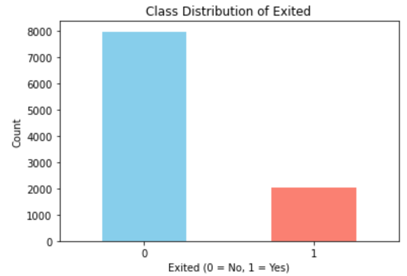
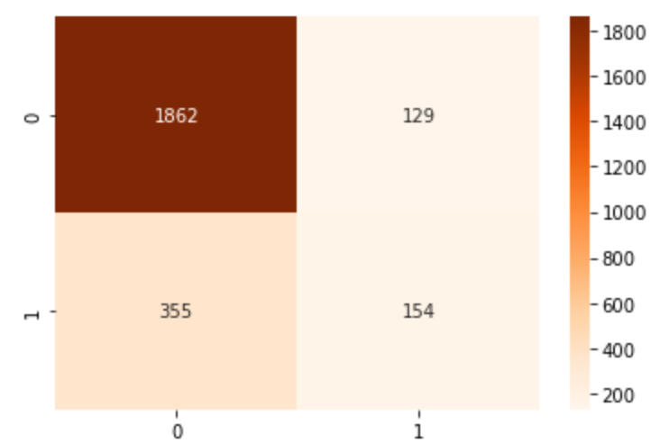

# Customer Churn Prediction Using Naive Bayes

## 🎯 Modeling Objective
The objective of this project is to develop and evaluate a Naive Bayes model for predicting customer churn using banking data.
Churn refers to customers leaving the bank, and by identifying them early, targeted actions—such as offering promotions or incentives—can be taken to improve customer retention.

## 🎯 Target Variable
The target variable is Exited, where:

0 = Customer stayed

1 = Customer left (churned)

The model is designed to predict whether each customer falls into the 0 or 1 category.

## 🛠️ Model Design
This is a binary classification task.
I chose the GaussianNB implementation of Naive Bayes because it is suitable for continuous variables and assumes a normal distribution.
Although the dataset does not perfectly meet these assumptions, GaussianNB often provides reliable results even with real-world imperfections.

## 📊 Dataset Features

The dataset includes the following features:
* CreditScore
* Age
* Tenure
* Balance
* NumOfProducts
* HasCrCard
* IsActiveMember
* EstimatedSalary
* Exited
* Loyalty
* Geography

## 🧹 Data Preprocessing
The following preprocessing steps were applied:

* Dropped irrelevant columns: RowNumber, CustomerId, Surname, and Gender
* Encoded the Geography (categorical) column into numerical format
* Engineered a new feature called Loyalty, calculated as:

  $$Loyalty = \frac{Tenure}{Age}$$

* as I engineered a new feature `loyalty` therefore `Tenure and Age` are dropped

* applied Min-Max Scaler:
I used a function called `MinMaxScaler`, which we'll import from the `sklearn.preprocessing` module. `MinMaxScaler` normalizes each column so every value falls in the range of [0, 1]. The column's maximum value would scale to 1, and its minimum value would scale to 0. Everything else would fall somewhere between. This is the formula:

$${x_{scaled}} = \frac{x - x_{min}}{x_{max} - x_{min}}$$ 

## ⚖️ Handling Imbalanced Data
The dataset is moderately imbalanced (~80% stayed vs. ~20% churned).

Since Naive Bayes predictions rely on class priors (P(c)), applying techniques like oversampling or undersampling would distort these natural priors.
For this reason, I retained the original class distribution and did not apply any balancing methods.

## Experiment Result:
Accuracy: 0.806
Precision: 0.544
Recall: 0.303
F1 Score: 0.389

All of our model metrics can be derived from the confusion matrix, and each metric tells its own part of the story. What stands out most in the confusion matrix is that the model misses a lot of customers who will churn. In other words, there are a lot of false negatives—355, to be exact. This is why our recall score is only 0.303.

